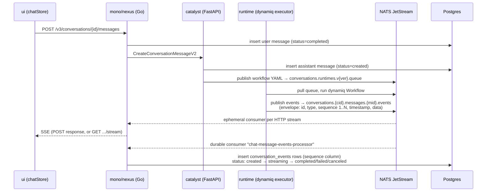

# PRD: Seamless chat stream resume (Claude/ChatGPT-style continuity for Super Agent)

| | |
|---|---|
| **Status** | Proposal — two research passes completed; every claim below verified against code in `ui`, `mono`, `catalyst`, `runtime`, `dynamiq` |
| **Date** | 2026-07-29 |
| **Scope** | `/chat` (Super Agent / LLM chat) in `dynamiq-ai/ui`, conversations API in `dynamiq-ai/mono` (nexus). The workflow/deployment chat (WebSocket path) is a separate transport and is untouched. |
| **TL;DR** | The backend already persists every chat event with a monotonic `sequence` and the stream endpoint already accepts `after_sequence` — the UI just never uses either. Fix is ~90% frontend + one ~5-line additive backend field. One subtlety: pending human-input (HITL) prompts must be reconstructed when seeding from history, since today only the full replay restores them. |

---

## 1. Problem

Super Agent conversations run server-side, so a user can start a run on their phone and pick it up on desktop — the execution infrastructure for that already works. The client experience around it doesn't:

- **Switching browser tabs restarts the stream.** Even a momentary tab switch on desktop aborts a perfectly healthy SSE connection. On return, the UI clears the in-progress assistant message, refetches the entire conversation (all messages *with* full event history, page size 500), and re-opens the stream **from event 1**, visibly replaying everything that was already on screen.
- **Reload / second device mid-run replays from zero.** Opening a conversation that is mid-stream renders nothing for the in-flight message, then replays the whole event stream from the beginning instead of showing what already happened and tailing live.
- **Every reconnect re-downloads and re-renders all events**, which for long agent runs (many tool calls, token deltas) is slow, janky, and wasteful for both client and server.

Target behavior — what Claude and ChatGPT do: returning to a conversation (tab switch, refresh, another device) instantly shows everything generated so far and the stream continues *from that point*, with no replay flicker and no duplicated content.

## 2. How it works today (verified end-to-end)



Key facts, with sources:

1. **Every event has a monotonic per-message `sequence` (1, 2, 3…).** Assigned by the runtime when wrapping dynamiq streaming output into the event envelope; `run.started` is 1, and HITL events share the same thread-safe counter, so ordering is continuous across workflow and human-input events. Sequences restart per message. → `runtime/app/services/nats_chat.py` (`_execute_workflow`, `_publish_streaming_events`, `_hitl_input_listener`), `runtime/app/schemas/nats.py` (`SequenceCounter`)
2. **Events are durably stored twice:** JetStream retains the full stream for **7 days** (`mono/services/nexus/internal/features/conversations/conversations.go`), and nexus persists every event into the `conversation_events` table keyed by event ID with a `sequence` column, tolerating duplicate delivery (`.../conversations/service/message_event.go`).
3. **The resume API already exists.** `GET /v1/conversation-messages/{message_id}/stream?after_sequence=N` replays only events with `sequence > N`, in strict order (server-side reorder buffer), and closes after the terminal event — including the case where the run ended before the cursor. Same for agent runs. `after_sequence` is validated `Min(1)`, so the param must be *omitted* (not 0) when there is no cursor. → `.../conversations/handler/handler.go`, `.../service/message.go` (`consumeConversationEvents`)
4. **The SSE payload already carries `sequence`.** Each `data:` line is the envelope `{id, type, sequence, timestamp, data}`; `data` is the inner dynamiq streaming event (`entity_id`, `wf_run_id`, `event`, `data.choices[].delta`, `source`). Note the *envelope* itself has no `source` for chat events (harmless: content events are self-describing, and the one consumer of envelope-level source receives it as optional). Envelope types: `run.started`, `run.data`, `run.completed`, `run.failed`, `run.canceled`, `run.human_feedback.received`, `run.approval_request.confirmed/rejected`. The server sends an SSE heartbeat *comment* every **15s**. → `mono/internal/types/api/stream.go`, `.../service/types.go`, `runtime/app/schemas/nats.py`
5. **Message status is tracked server-side.** The assistant message is created as `created` (by catalyst), flips to `streaming` on `run.started`, then to `completed`/`failed`/`canceled` on the terminal event — via the durable JetStream consumer. `GET /v1/conversations/{id}/messages` embeds each message's persisted events (ordered by sequence); this is how completed messages already re-render tool calls after a refresh. → `catalyst/app/services/conversations/agent_conversations.py` (`agent_conversation_request`), `mono/.../service/message_event.go`
6. **`dynamiq` and `runtime` need no changes.** Streaming originates from `dynamiq/callbacks/streaming.py` (`AsyncStreamingIteratorCallbackHandler`); sequencing/persistence live above the framework. The runtime even has an established sequence-continuity precedent (checkpoint `run.paused`/`run.resumed` on the apps path).

## 3. Root causes (all in `dynamiq-ai/ui`)

| # | Cause | Where |
|---|---|---|
| 1 | On **every** `visibilitychange → visible`, the UI aborts the active stream, wipes in-progress state (`messagePart`, `thinkingText`, `tools`), and invalidates the messages query — even when the connection is healthy. React Query's `refetchOnWindowFocus` is globally `false`, so this hook is provably the *sole* trigger of the tab-switch replay. It was written for iOS Safari killing background connections, but `visibilitychange` also fires on every desktop tab switch. | `src/pages/chat/components/Messages/hooks/useVisibilityReconnect.ts`, `src/api/queryClient.ts` |
| 2 | Reconnection always calls `GET /v1/conversation-messages/{id}/stream` **without `after_sequence`**, so the server replays from event 1. | `src/stores/chatStore/actions/streamConversationMessage.ts`, `reconnectStream.ts` |
| 3 | The client never reads the `sequence` field it already receives in every SSE event (verified: no reference anywhere in `ui/src`), so it has no cursor to resume from and no duplicate protection. | `src/stores/chatStore/actions/processLLMStream.ts` |
| 4 | On load of a mid-stream conversation, the streaming message's already-persisted events (present in the messages response) are **discarded** (`status === 'streaming'` messages are filtered out), and the full replay is used to rebuild the UI instead. | `src/pages/chat/components/Messages/hooks/useSyncMessages.ts`, `useStreamingReconnect.ts` |
| 5 | `reconnectStream` explicitly clears partial content before re-streaming — necessary today *because* of the full replay, but it's what causes the visible reset. | `src/stores/chatStore/actions/reconnectStream.ts` |
| 6 | Reconnect only triggers on `status === 'streaming'`. A message still queued (`status === 'created'`, before the runtime picks it up) is rendered as an empty bubble and never connected. The UI's TS type doesn't even list `created`/`canceled`. | `useStreamingReconnect.ts`, `src/types/conversation.ts` |

One backend gap: the messages list embeds events as **raw inner payloads only** — the envelope's `sequence` is stripped (`mono/services/nexus/internal/api/types.go`, `ConversationMessageFrom`). So after a fresh load the UI can render persisted events but cannot know which sequence to resume after. (The standalone `GET /v1/conversation-messages/{id}/events` endpoint *does* return sequences, but using it would add an extra paginated request per reconnect.)

## 4. Proposed changes

### P0 — resume instead of replay (the actual fix)

**mono (nexus), ~5 lines, backward compatible:**

- **M1.** Add `last_event_sequence` to the message DTO in `ConversationMessageFrom` — the max `Sequence` of the loaded events (already loaded, already ordered; take the last). This gives the client its resume cursor for the fresh-load case.

**ui:**

- **U1. Track the cursor.** In `chatStore`, add `lastEventSequence` and `lastStreamActivityAt`. In `processLLMStream`: update `lastStreamActivityAt` on every raw reader chunk — heartbeats are SSE *comments*, which `eventsource-parser` never surfaces as events, so activity must be tracked at the reader loop, not in `onEvent`. Read `parsed.sequence` from each envelope, **skip any event with `sequence <= lastEventSequence`** (dedupe safety for at-least-once delivery), then advance the cursor. The cursor is **per-message**: reset it when `currentMessageId` changes, on new send, and on conversation switch.
- **U2. Stop killing healthy streams.** In `useVisibilityReconnect`: on becoming visible, if `isAnswering` and the stream showed activity within the staleness threshold (suggest **45s** = 3 missed heartbeats), do nothing — skip the abort *and* the messages refetch. Only when stale (backgrounded long enough for the browser/OS to have killed the connection — the original iOS case): abort and fall through to reconnect. This alone fixes the desktop tab-switch complaint.
- **U3. Resume with the cursor.** `streamConversationMessage` and `reconnectStream` append `?after_sequence=<lastEventSequence>` when the cursor is ≥ 1 (omit otherwise — the server rejects 0), and **stop wiping partial content** when resuming with a cursor — new events append to the existing `messagePart`/`thinkingText`/`tools` state.
- **U4. Seed from persisted events on fresh load.** In `useSyncMessages`/`useStreamingReconnect`: for a message with a non-terminal status, run its embedded `events` through the existing `parseMessageEvents` to seed the store's partial state, set `lastEventSequence = message.last_event_sequence`, then open the stream with `after_sequence`. Result: instant render of everything generated so far + live tail, on refresh and on a second device.
  **Required sub-task — HITL prompt reconstruction.** `parseMessageEvents` today does *not* rebuild pending human-feedback/approval prompts; only the live path does (`processLLMStream` → `buildHumanFeedbackTag`). Today's replay-from-zero is what restores a pending prompt after refresh, so seeding must port that logic or mid-HITL refreshes regress: while parsing, treat a `HumanFeedbackTool` `streaming`/`approval` event as *pending* if no later `run.human_feedback.received` / `run.approval_request.*` event follows, and re-emit the `<human-feedback>` tag + `humanFeedbackTool` store state for it.
- **U5. Status robustness.** Reconnect for any *non-terminal* status (`created` or `streaming`), not just `streaming` — covers the queue-wait window between POST and `run.started` (the stream endpoint works fine during it: it idles on heartbeats until events arrive). Add `created`/`canceled` to the UI's status type.

No changes to `catalyst`, `runtime`, or `dynamiq` for P0.

### P1 — polish and hardening (small, independent)

- **SSE `id:` field.** Emit the envelope sequence as the SSE `id:` in `api.StreamEvents`, and optionally accept a `Last-Event-ID` header as an alias for `after_sequence`. Aligns with the SSE standard and unlocks off-the-shelf clients (e.g. `@microsoft/fetch-event-source`) later.
- **Server replay efficiency.** `consumeConversationEvents` uses `DeliverAllPolicy` and skips client-side, so each reconnect still scans the subject from the start server-side. Bounded per message, so acceptable — but `DeliverByStartTime` (timestamp of the last-seen event) is a cheap optimization for very long runs.
- **Slimmer conversation fetch.** `GET /v1/conversations/{id}/messages` (page size 500, server max 500) embeds the full event history of every message. Consider lazy-loading events per message, or embedding them only for the streaming/last message and letting completed messages fetch on demand.

### P2 — full cross-device "live" parity (separate project, optional)

- **Conversation-level event stream** (`GET /v1/conversations/{id}/stream`): bridge `message.created` + per-message events so a conversation open in another tab/device picks up *new* messages in real time, not just on refocus/refetch. The NATS subject layout (`conversations.{cid}.messages.*.events`) already supports this with a wildcard consumer.
- **Cross-tab stream dedupe** (SharedWorker/Web Locks) so N tabs of the same conversation share one connection.

## 5. Acceptance criteria

1. Desktop: start a run, switch tabs briefly (<45s), return → no visual reset, no messages refetch, zero additional `/stream` requests.
2. Tab backgrounded long enough for the connection to die → on return the UI resumes with `after_sequence=<last seen>`; already-rendered content does not flicker or duplicate; only new events arrive (verify in devtools).
3. Hard refresh mid-run, or opening the conversation on a second device → partial content renders immediately from persisted events; stream tails live from `last_event_sequence`; no replay from event 1.
4. iOS Safari background/foreground mid-run → same as (2) (this was the original reason for the visibility hook — must not regress).
5. Run completes/fails/cancels while the tab is hidden → on return the final message renders once, correctly (existing terminal-status handling preserved; a terminal event *before* the resume cursor closes the stream immediately server-side).
6. HITL: a pending human-feedback / approval / browser-takeover prompt survives a tab switch *and* a hard refresh mid-wait (reconstructed from persisted events per U4), and answering it afterwards still works end-to-end.
7. Duplicate delivery from NATS (at-least-once) never renders twice — cursor dedupe in `processLLMStream`.
8. Send-path regression check: a brand-new message (POST response stream) behaves exactly as today; cursor starts fresh per message.

## 6. Effort estimate

| Work | Estimate |
|---|---|
| mono: `last_event_sequence` field (+ optional SSE `id:`) | 0.5–1 day |
| ui: U1–U3, U5 + unit tests (hook tests already exist, e.g. `useSyncMessages.test.ts`) | 2–3 days |
| ui: U4 incl. HITL prompt reconstruction + tests | 1–2 days |
| QA across Chrome/Safari/iOS + multi-device | 1–2 days |

## 7. Open questions

1. Staleness threshold for "the stream is probably dead" — proposal: 45s (3× the 15s server heartbeat). Alternatively reconnect-on-any-hidden->visible after >60s hidden.
2. Keep the unconditional messages refetch on refocus for *data freshness* (titles, new messages from other devices) even when the stream is healthy? Proposal: no for the chat body (P2 solves it properly); the conversation list sidebar can keep its own cheaper invalidation.
3. JetStream retention is 7 days — fine for chat runs, but confirm no product plans for pausable runs longer than that (persisted events in Postgres cover rendering either way; only live-resume via JetStream is bounded).
4. Is multi-tab double-streaming (one SSE per tab of the same conversation) acceptable server load for now? (Each is an ephemeral consumer with a 3-minute inactive threshold; P2 dedupe removes it.)

---

### Appendix A — verified wire format

**SSE frame (live stream, both POST response and GET `/stream`):**

```
event: run.data
data: {"id":"<uuid>","type":"run.data","sequence":42,"timestamp":"…",
       "data":{"entity_id":"…","wf_run_id":"…","event":"streaming",
               "data":{"choices":[{"delta":{"content":…,"thinking_blocks":…}}]},
               "source":{"id":"…","name":"…","type":"…"}}}
```

- Envelope types: `run.started` (seq 1) · `run.data` · `run.human_feedback.received` · `run.approval_request.confirmed|rejected` · terminal: `run.completed` | `run.failed` | `run.canceled`
- Persisted `events[]` in `GET /v1/conversations/{id}/messages` = the **inner** `data` objects only (envelope stripped — hence M1)
- `GET /v1/conversation-messages/{id}/events` = full envelopes incl. `sequence` (paginated)
- Message statuses: `created → streaming → completed | failed | canceled`
- Heartbeat: SSE comment `: heartbeat` every 15s (not surfaced by `eventsource-parser` — track activity at the reader)

### Appendix B — primary code references

`ui`: `src/pages/chat/components/Messages/hooks/{useVisibilityReconnect,useStreamingReconnect,useSyncMessages}.ts`, `src/stores/chatStore/actions/{processLLMStream,streamConversationMessage,reconnectStream,sendLlmMessage,buildHumanFeedbackTag}.ts`, `src/pages/chat/components/Messages/parseMessageEvents.ts` ·
`mono`: `services/nexus/internal/features/conversations/{handler/handler.go,service/message.go,service/message_event.go,consumer/message_event.go,conversations.go}`, `internal/types/api/stream.go`, `services/nexus/internal/api/types.go`, `internal/list/pagination.go` ·
`catalyst`: `app/services/conversations/agent_conversations.py`, `app/db/pg/models/conversation_message.py` ·
`runtime`: `app/services/nats_chat.py`, `app/schemas/nats.py` ·
`dynamiq`: `dynamiq/callbacks/streaming.py`, `dynamiq/types/streaming.py`
