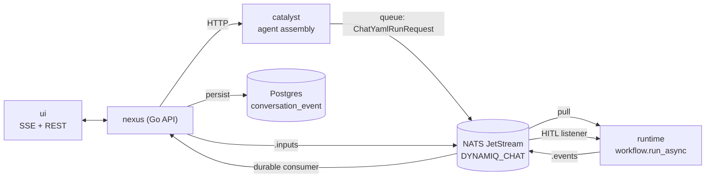
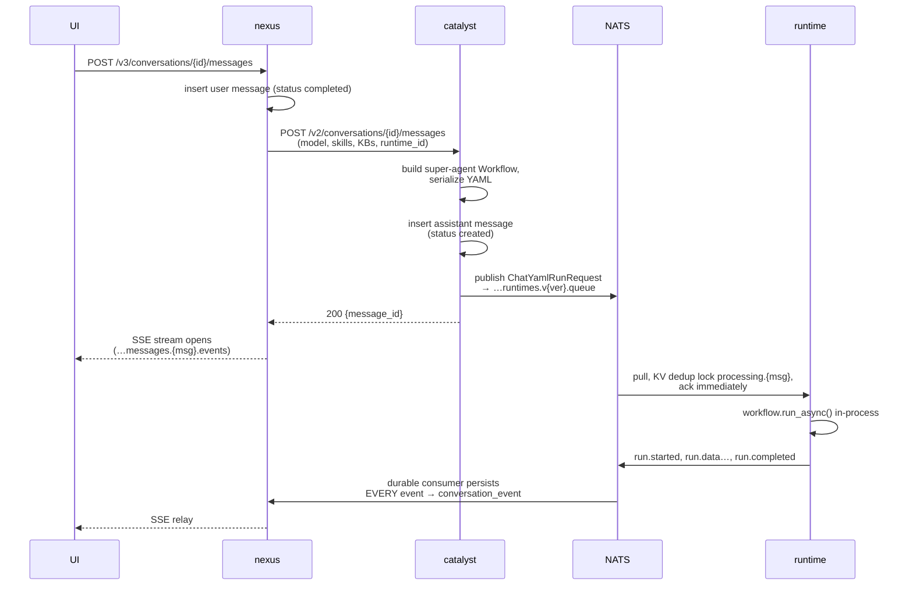
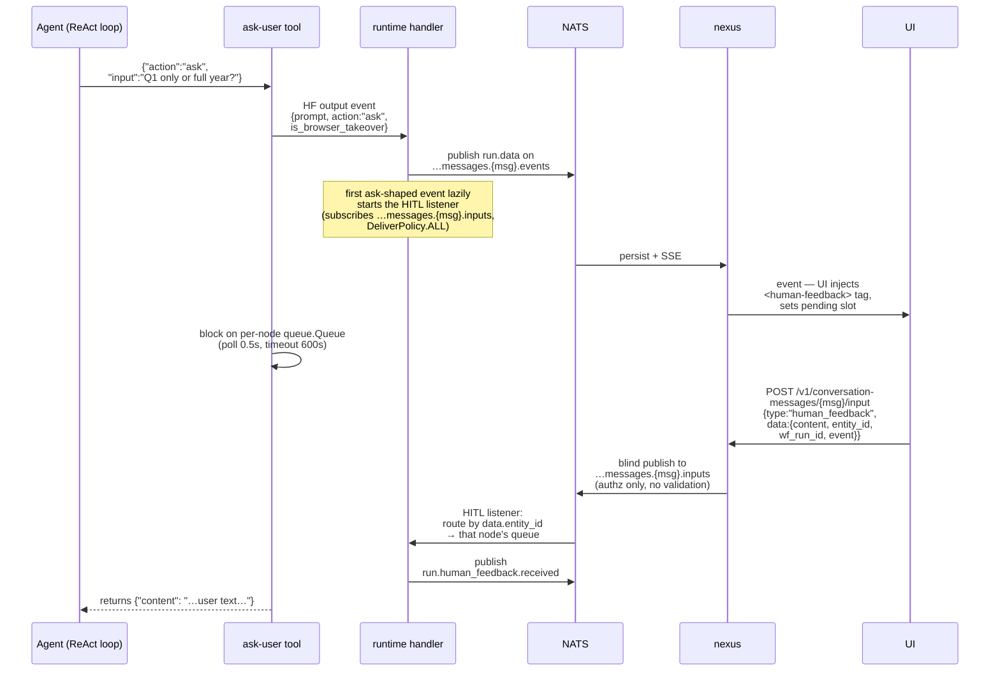
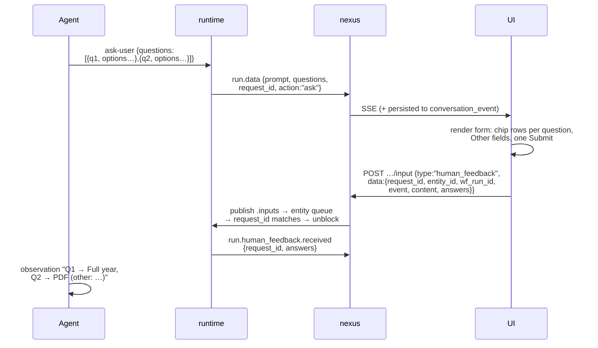
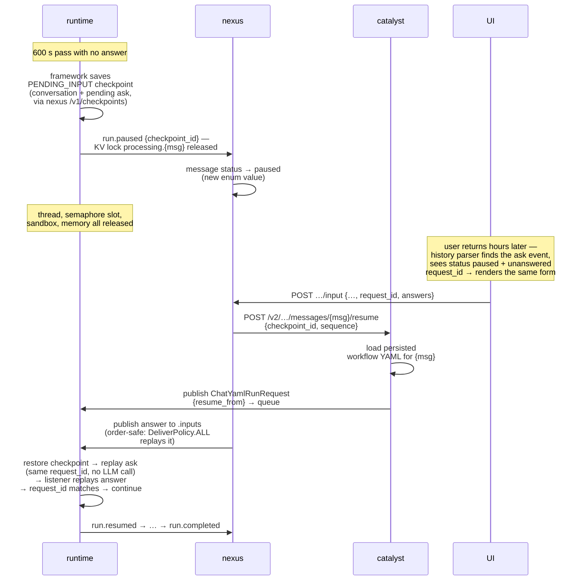

# Structured Multi-Question Human Input for the Super Agent

**Research report & implementation proposal — for engineering review**

This document proposes adding Claude Code–style structured questions ("AskUserQuestion") to the Dynamiq
super agent, and documents the verified current state of the human-in-the-loop (HITL) infrastructure across
all six repos: `dynamiq` (framework), `catalyst`, `runtime`, `mono` (nexus/synapse), `ui`, and `charts`.

Every factual claim was verified directly against source at these revisions:

| Repo | Commit | Repo | Commit |
|---|---|---|---|
| `dynamiq` | `f67c889` (v0.59.0) | `mono` | `baf8ef3` |
| `catalyst` | `179ee20` | `ui` | `0405eb7` |
| `runtime` | `b562614` (v1.52.0) | `charts` | `86734cb` |

---

## 1. What we're trying to achieve, and why

Today the super agent can ask the user something mid-run via the `ask-user` tool, but the interaction is
primitive: the agent emits **one free-text question**, the UI shows a static "Waiting for your answer" box,
and the user types a reply into the normal composer. The tool's own prompt guidance enforces the limitation:
*"Prefer a single focused question over multiple questions at once. … The user can only provide text
responses"* (`catalyst/app/services/conversations/agent_conversations.py:157-182`).

We want the interaction Claude Code users get from its `AskUserQuestion` tool:

- **Structured options.** A question ships with 2–4 predefined options, each with a label and a short
  description. The user clicks instead of typing. A free-text "Other" escape hatch remains.
- **Several questions in one round-trip.** The agent batches up to ~4 related questions into **one** tool
  call; the UI renders one form; the user submits **all answers at once**. (Claude Code also tags each
  question with a ≤12-char `header` chip and a `multiSelect` flag — we adopt both.)
- **Sequential rounds.** After seeing the answers, the agent may ask a follow-up round.
- **Long-pause resilience.** The user may answer after 1 minute, 1 hour, or 24 hours. The run must survive,
  the question must still be visible (and answerable) after a page reload, and infrastructure must not hold
  expensive resources hostage for the whole wait.

Why this matters: clarifying questions are the highest-leverage moment in an agent run — a good question at
the right time prevents minutes of wasted work. Making answers one click instead of one paragraph raises
response rates and speed; making the wait durable means a question asked at 6 pm still gets its answer at
9 am without losing the run.

**The headline finding:** the platform is already ~80 % of the way there. The transport, correlation,
event persistence, sequential Q&A semantics, and — on the *apps* path — a complete
*timeout → checkpoint → pause → resume* loop already exist and work. What's missing is a structured question
schema end-to-end, the pause/resume wiring on the *chat* path (it exists on the apps path and needs porting),
a real answer UI, and a per-ask `request_id`. No new services, queues, or storage systems are required.

---

## 2. System primer — who does what

For engineers who work in one repo and haven't seen the whole chain:

| Component | Repo | Role in `/chat` |
|---|---|---|
| **UI** | `ui` (React/Vite, zustand) | Renders the ChatGPT-style chat at `/chat` (`ChatType.LLM`). Talks REST + **SSE** to nexus. |
| **nexus** | `mono` (Go) | Public HTTP API. Owns conversations/messages/events in Postgres, streams events to the UI over SSE, forwards user input into NATS. |
| **synapse** | `mono` (Go) | Same pattern for **deployed-app runs** (not `/chat`). Owns `app_run`, checkpoint resume dispatch, and the `app_run_input_request` registry. The reference implementation for pause/resume. |
| **catalyst** | `catalyst` (Python/FastAPI) | Control plane that **assembles the super agent** (tools, prompt, LLM, sandbox) as a `dynamiq` Workflow, serializes it to YAML, and dispatches it to the runtime via NATS. Also hosts Slack/Telegram chat adapters. Does **not** execute agents. |
| **runtime** | `runtime` (Python) | The executor. Pulls run requests from NATS JetStream, runs `workflow.run_async()` in-process, publishes events back, feeds HITL answers into the blocked tool. One asyncio process; version-pinned deployments (`v1-52-0` etc.). |
| **dynamiq** | `dynamiq` (Python lib) | The agent framework: `Agent` (ReAct loop), `HumanFeedbackTool`, streaming, checkpoints. Pinned at `0.59.0` by both catalyst and runtime (`catalyst/pyproject.toml:9`, `runtime/pyproject.toml:12`). |
| **NATS JetStream** | external (see `charts`) | Bus + durable event log. Stream `DYNAMIQ_CHAT`, subjects `dynamiq.chat.>`, file storage, **7-day MaxAge**, plus a KV bucket (7-day TTL) used for run dedup locks (`mono/services/nexus/internal/features/conversations/conversations.go:30-51`). |
| **Postgres** | external | System of record: `conversation`, `conversation_message`, `conversation_event` (nexus side); `checkpoint`, `app_run*` (apps side). |



### NATS subjects (chat)

Prefix `dynamiq.chat` (`runtime/app/core/settings.py:80`, `mono` config default):

| Subject | Direction | Purpose |
|---|---|---|
| `…conversations.runtimes.v{ver}.queue` | catalyst → runtime | dispatch `ChatYamlRunRequest` (`agent_conversations.py:1785`) |
| `…conversations.{conv}.messages.{msg}.events` | runtime → nexus/UI | all run events, monotonic `sequence` |
| `…conversations.{conv}.messages.{msg}.inputs` | nexus → runtime | **HITL answers** |
| `…conversations.{conv}.messages.{msg}.commands` | nexus → runtime | `cancel` |

The runtime consumes the version-pinned queue with durable `chat-message-processor-v{ver}`
(`nats_chat.py:221-229`); nexus resolves which runtime version to target per message via its runtimes
registry (`message.go:167-170`).

---

## 3. Verified current behavior

### 3.1 A chat message, end to end



Key verified facts:

- The super agent is a flat 3-node Workflow (`Input → Agent(id="super-agent") → Output`), `max_loops=250`,
  `parallel_tool_calls_enabled=True`, E2B sandbox, summarization at 200k tokens
  (`agent_conversations.py:1089-1142`). No orchestrator.
- The workflow YAML travels **only inside the queue message** (`ChatYamlRunRequest{conversation_id,
  message_id, workflow_yaml_config, input}`, `agent_conversations.py:1787-1794`). Neither nexus nor Postgres
  ever sees it. (This constrains the resume design — §5.4.)
- The runtime **acks the queue message at dispatch**, before the run executes (`nats_chat.py:264-278,
  385-398`). Redelivery can never resume a run; crash-safety must come from checkpoints.
- Runs are gated by an `asyncio.Semaphore(NATS_MAX_CONCURRENT_RUNS)` — default **50 per handler per pod**
  (`settings.py:56`); prod runs 2–5 pods (`runtime/k8s/base/runtime/{deployment,hpa}.yaml`).
- nexus persists **every** event type into `conversation_event` — the insert at
  `service/message_event.go:52` is unconditional; the status `switch` above it only maps
  `run.started/completed/failed/canceled`. Unknown types (e.g. a future `run.paused`) are stored untouched.
- Nobody needs to be connected: the durable consumer (`chat-message-events-processor`, AckWait 30 s,
  MaxDeliver 3, `consumer/message_event.go:19-60`) persists events regardless of viewers.

### 3.2 The `ask-user` loop today

The agent has two `HumanFeedbackTool` instances (`agent_conversations.py:857-885`): `ask-user` and
`browser-takeover`, both `input_method=FeedbackMethod.STREAM`, `ErrorHandling(timeout_seconds=600,
behavior=RAISE)`, `msg_template="{{ input }}"`.

**Disambiguation detail worth knowing:** the agent's token stream uses event name `"data"`
(`agent_conversations.py:932-938`) while the HITL tools keep the default `"streaming"` — both the UI and the
runtime key on that difference plus `source.type == "dynamiq.nodes.tools.HumanFeedbackTool"`.



Wire formats (`dynamiq/nodes/tools/human_feedback.py:24-39`):

```
ask  →  {prompt: str, action: "ask"|"info", is_browser_takeover: bool}
reply ←  {content: str}
```

There is **no representation for options, multi-select, headers, or multiple questions.** The reply is one
string. Correlation is (subject = `message_id`) + (`entity_id` = dynamiq node id → per-node queue,
`nats_chat.py:1069-1084, 1174-1215`). There is no per-question identity.

**Batching semantics today:** `HumanFeedbackTool` does not set `is_parallel_execution_allowed` (defaults
`False`, `dynamiq/nodes/node.py:280`), so even when the LLM emits several `ask-user` calls in one turn, the
agent executes them **sequentially** — phase 2 of `_run_tools` (`dynamiq/nodes/agents/agent.py:2389-2440`).
Safe (no queue races), but each question is a separate round-trip; that's the UX we're replacing with a
batched form, and why "several questions at once" must ride in **one** tool call.

### 3.3 What happens when nobody answers — the 600-second cliff

The blocked tool polls its queue with a hard cap: `StreamingConfig.timeout` defaults to **600.0 s**
(`dynamiq/types/streaming.py:210`). The chat runtime handler builds the per-node override **without passing
`timeout`** (`nats_chat.py:1075-1082`), so 600 s always applies. (The apps handler *does* forward the node's
configured timeout — `nats.py:989-997`. The asymmetry is accidental, not designed.)

On expiry (`dynamiq/nodes/node.py:1565-1574`):

1. If a checkpoint context exists → save checkpoint, mark `PENDING_INPUT`. **On the chat path none exists**
   (`nats_chat.py` contains zero checkpoint references).
2. Raise `InputStreamingTimeoutError` → tool RAISE → agent loop fails → flow FAILURE →
   runtime publishes **`run.failed`** → nexus marks the message **`failed`**.

**The turn is lost.** A user who steps away for 11 minutes returns to a dead run and a failed message.
While waiting, the run also pins real resources: a thread-pool thread (the tool's blocking wait), the asyncio
task, the whole in-memory Workflow, one of the 50 semaphore slots, and the E2B sandbox.

### 3.4 The apps path already solved long pauses — this is the pattern to port

For deployed-app runs, the identical runtime codebase wires checkpoints (`nats.py:492-538`):

```python
CheckpointConfig(
    enabled=True, backend=AppCtx.checkpoint_backend,       # HTTP → nexus /v1/checkpoints → Postgres
    behavior=CheckpointBehavior.REPLACE,
    checkpoint_after_node_enabled=False,
    checkpoint_mid_agent_loop_enabled=False,
    checkpoint_on_failure_enabled=False,
    checkpoint_on_cancel_enabled=False,
    checkpoint_on_input_timeout_enabled=True,              # ← the HITL case
    resume_from=verified_resume_id,
)
```

On input timeout the framework snapshots the **enclosing agent**, not just the tool: full serialized
conversation, loop counter, LLM/tool sub-state, and the in-flight tool call
(`pending_action/pending_action_input/pending_thought`) so resume **replays the exact ask without re-calling
the LLM** (`dynamiq/nodes/agents/checkpoint.py:26-137`; owner resolution
`dynamiq/checkpoints/checkpoint.py:382-426`). The runtime then converts the failure into a pause
(`nats.py:596-621`): publish `run.paused(checkpoint_id)` and **delete the `processing.{run_id}` KV dedup
lock** so a later dispatch with the same run id is accepted.

Synapse's side (`mono/services/synapse/internal/root/handler/apps/run/`):

- `run.paused` → `app_run.status = 'paused'` (`consumer.go:190-201`).
- Every ask/approval event creates a **pending request row**: `app_run_input_request(id, run_id,
  runtime_target jsonb, type, prompt, params, editable_params, status pending|resolved)`
  (`database/schema.sql:459-475`), keyed deterministically — `uuid.Hash(WfRunID + ":" + EntityID)`
  (`request_store.go:130-134`) — and surfaced to clients as `data.id`.
- Answer, hours or days later: `SendRunInput` (`service.go:439-484`) rejects unless `started|paused`; if
  `paused` it finds the newest `run.paused` event's `checkpoint_id` (`lookupResumeFrom`, `service.go:786-812`,
  note the `sequence - 1` offset), **re-dispatches** a `RunStartMessage{resume_from}`, then publishes the
  answer to `…runs.{id}.inputs`, then resolves the request row.
- The resumed run replays the ask; the HITL listener subscribes with **`DeliverPolicy.ALL`**
  (`runtime/app/core/clients/nats.py:180`), so the already-published answer is replayed to it. Run continues.
- There is **no server-side answer deadline**: the pending row has no TTL and `ReasonTimeout` is declared but
  never used (`run/message.go:17`). Demo of the whole loop: `runtime/clients/checkpoints/nats_demo.py`.

Synthetic run status for clients (`run/service.go:236-248`): `awaiting_input` is derived via SQL `EXISTS`
over pending request rows.

### 3.5 Refresh, reconnect, and history — what survives today

- **Refresh during a live wait: works.** The UI re-opens
  `GET /v1/conversation-messages/{msg}/stream` when the last message is `streaming`
  (`useStreamingReconnect.ts:19-28`), the backend replays the whole event log (ephemeral consumer,
  `DeliverAll`, `service/message.go:380-478`), and the replayed events run through the same parser
  (`reconnectStream.ts:60`), which re-synthesizes the question and the pending state.
- **Return after the 600 s timeout: broken.** Message status is `failed`; nothing reconnects; and the
  history path drops the question silently — `parseMessageEvents.ts` has **no `HumanFeedbackTool` branch**,
  so the persisted ask event contributes nothing to the rebuilt transcript. The pending state also lives
  only in a non-persisted zustand slot (`useChatStore.ts:57`) set by the live stream
  (`processLLMStream.ts:126-152`).
- The answer UI is a 12-line static component (`AskUserFeedback.tsx`) — prompt text plus a "Waiting for your
  answer" label; the actual answer is typed into the main composer and POSTed by `TextTyper.tsx:246-259`.
- Interactive precedent exists: the approvals flow renders a real Formik form with editable params and an
  Approve button inside a message (`ApprovalComponent.tsx`), using JSON-in-tag-children encoding — proof the
  message stream can host interactive controls.

### 3.6 Claim → evidence index

| # | Claim | Evidence |
|---|---|---|
| 1 | Ask/reply wire format is plain strings | `dynamiq/nodes/tools/human_feedback.py:24-39` |
| 2 | 600 s default input wait; poll loop | `dynamiq/types/streaming.py:210`; `dynamiq/nodes/node.py:1530-1602` |
| 3 | Chat override omits timeout; apps forwards it | `runtime/app/services/nats_chat.py:1075-1082` vs `nats.py:989-997` |
| 4 | Chat path has no checkpoints; timeout ⇒ `run.failed` | grep `checkpoint` in `nats_chat.py` = 0 hits; `RunFailedEvent` at `:519,543,641,821` |
| 5 | Apps path pauses instead: `PENDING_INPUT` → `run.paused` + KV unlock | `runtime/app/services/nats.py:492-538, 596-621` |
| 6 | Checkpoint captures conversation + in-flight tool call; replay w/o LLM | `dynamiq/nodes/agents/checkpoint.py:26-137` |
| 7 | Resume dispatch on answer to paused run | `mono/…/apps/run/service.go:439-484, 786-812` |
| 8 | Pending-request registry (apps only) | `mono/database/schema.sql:459-475`; `request_store.go:32-72` |
| 9 | Deterministic request key (collides per entity) | `request_store.go:130-134` |
| 10 | Chat input endpoint is a blind passthrough | `mono/…/conversations/service/message.go:204-216` |
| 11 | All events persisted incl. HITL ask | `mono/…/service/message_event.go:19-96` (insert at `:52` unconditional) |
| 12 | `conversation_message` has no paused/awaiting state | `mono/database/schema.sql:1173` |
| 13 | HITL answers route per `entity_id` queue; unknown id → silent black hole | `nats_chat.py:1069-1084, 1174-1215` |
| 14 | Inputs listener replays all retained answers (`DeliverPolicy.ALL`) | `runtime/app/core/clients/nats.py:167-181` |
| 15 | Queue msg acked at dispatch; crash ⇒ no redelivery | `nats_chat.py:264-278, 385-398` |
| 16 | HF tool not parallel-eligible ⇒ sequential asks | `dynamiq/nodes/node.py:280`; `dynamiq/nodes/agents/agent.py:2389-2440` |
| 17 | Agent event `"data"` vs HITL `"streaming"` disambiguation | `agent_conversations.py:932-938` vs `:857-885` |
| 18 | UI: live detection / tag / single pending slot | `processLLMStream.ts:126-152`; `buildHumanFeedbackTag.ts` |
| 19 | UI: history drops HITL events; stub answer UI | `parseMessageEvents.ts` (no HF branch); `AskUserFeedback.tsx` |
| 20 | 7-day stream MaxAge; KV bucket 7-day TTL | `mono/…/conversations/conversations.go:30-51` |
| 21 | Both catalyst & runtime pin `dynamiq==0.59.0` | `catalyst/pyproject.toml:9`; `runtime/pyproject.toml:12` |
| 22 | Prod runtime: 2 replicas, 1800 s grace, CPU-only HPA | `runtime/k8s/base/runtime/deployment.yaml:9,77`; `hpa.yaml` |

---

## 4. Gap analysis

| Capability | Status today | What's missing |
|---|---|---|
| Single free-text question | ✅ end-to-end | — |
| Options / multi-select / headers | ❌ | Schema in framework event + UI form + answer payload |
| Several questions per round-trip | ❌ (N sequential asks) | `questions[]` in one ask call ⇒ one event ⇒ one reply |
| Sequential rounds | ⚠️ live-path works | `request_id` (see bugs below) |
| Pause > 600 s — chat | ❌ turn dies (`run.failed`) | Port apps checkpoint block + resume dispatch |
| Pause > 600 s — apps | ✅ | — |
| Refresh during wait | ✅ full replay | — |
| Reload after long pause | ❌ | UI history branch + pending-state derivation + `paused` status |
| Answer while disconnected | ✅ (durable consumers) | — |

### Correctness issues found while verifying (fix in the same effort)

1. **Stale-answer replay.** The inputs listener re-reads *every* retained answer for the message
   (`DeliverPolicy.ALL`, 7-day retention) whenever it (re)subscribes — that's what makes resume work, but the
   consuming side filters only by event name (`node.py:1589-1598`). Round 1's answer can therefore satisfy
   round 2's question after a pause/resume or listener restart. Fix: per-ask `request_id`, echoed in the reply
   and checked before accepting.
2. **Deterministic request key collides (apps).** `uuid.Hash(WfRunID + ":" + EntityID)` is intentionally
   stable (idempotent for a *replayed* ask — good) but two *different* sequential questions from the same
   node produce the same row id, and `Store` swallows the duplicate (`request_store.go:63-66`). Include the
   `request_id` in the key.
3. **`info` renders as a question (UI).** Live detection keys on `source.type` only
   (`processLLMStream.ts:126-128`), so a fire-and-forget `info` message transiently shows "Waiting for your
   answer". One-line fix: require `data.action !== 'info'`. (The runtime already excludes `info` when starting
   the listener — `nats_chat.py:1086-1101`.)
4. **Hard-kill orphans (both paths).** Since the queue message is acked at dispatch, a pod killed mid-wait
   *before* the timeout leaves: no `run.paused`, a stuck `processing.{id}` KV lock (until the 7-day bucket
   TTL), and a `started` run forever — there's no reaper in mono. Orthogonal to this feature, but long waits
   make it more visible. A sweep job + KV-lock release on stale runs is cheap insurance.
5. **Ops blind spots.** CPU-based HPA can't see parked runs (they're ~0 CPU but hold semaphore slots);
   checkpoint load on resume is a **synchronous `requests.get` on the event loop with no timeout**
   (`nats.py:499`, `runtime/app/core/clients/nexus.py:312-370`); the self-hosted chart ships no
   `terminationGracePeriodSeconds` (30 s default) vs 1800 s in the SaaS kustomize base, and no ingress
   idle-timeout annotations for hour-long SSE waits (ALB/nginx default ≈ 60 s).

---

## 5. Proposed design

### 5.0 Principles

- **Extend `HumanFeedbackTool`; don't fork a parallel system.** The transport, correlation, persistence,
  and checkpoint semantics are already correct for it. One tool keeps the agent's decision surface small.
- **Text fallback everywhere.** Every structured ask also carries a rendered `prompt` string, and every
  structured answer also carries a rendered `content` string, so Slack, Telegram, old UIs, and the LLM
  observation all degrade gracefully. (Catalyst's Slack/Telegram adapters parse events with their own enum
  that knows only 5 event types — `catalyst/app/schemas/nats_events.py:12-17` — they keep working untouched.)
- **One batch = one tool call = one event = one reply.** Don't build multi-slot UI state or cross-question
  correlation; the batch is atomic.
- **`request_id` is the identity of an ask round.** Minted by the tool per ask; echoed by every reply;
  checked at the queue consumer. Fixes replay bugs and makes resume-safe delivery by design.

### 5.1 Schema (framework, `dynamiq/nodes/tools/human_feedback.py`)

```python
class QuestionOption(BaseModel):
    label: str                        # short, shown on the chip
    description: str | None = None    # one-line explanation

class Question(BaseModel):
    id: str | None = None             # defaults to index within the batch
    header: str | None = None         # ≤12-char chip label, e.g. "Scope"
    question: str
    options: list[QuestionOption] = []
    multi_select: bool = False
    allow_custom_answer: bool = True  # "Other" free-text escape hatch

class HumanFeedbackInputSchema(BaseModel):
    action: HumanFeedbackAction = ASK
    input: str = ""                            # unchanged: plain ask / fallback text
    questions: list[Question] | None = None    # NEW: 1–4 structured questions

class Answer(BaseModel):
    question_id: str
    selected: list[str] = []                   # chosen option labels (or ids)
    custom_text: str | None = None

# events
HFStreamingOutputEventMessageData  += questions: list[Question] | None, request_id: str
HFStreamingInputEventMessageData   += answers: list[Answer] | None, request_id: str | None
```

Behavior changes in the tool:

- `_execute_ask` mints `request_id`, renders a text `prompt` (numbered questions + options) as fallback, and
  emits the event with both.
- The receive loop accepts a reply only if its `request_id` matches or is absent (backward compat); anything
  else is discarded with a log line, not consumed.
- The tool formats structured answers into a readable observation for the LLM
  (`"Q: … → A: label1, label2 (other: …)"`) and returns raw `answers` alongside `content` in its output.

Nothing else in the framework changes. Checkpoint-on-input-timeout, pending-tool-call replay, and per-node
queues already behave correctly for the batched form. Note `questions` is **call-time input from the LLM**,
not YAML config — the serialized workflow format is unchanged, so catalyst⇄runtime YAML compatibility is
unaffected; only the runtime's `dynamiq` pin strictly gates execution (bump both anyway — §6).

### 5.2 Target flow — fast path (answered within the in-memory window)



### 5.3 Target flow — long pause (the 24-hour story)



### 5.4 Changes per repo (with reasoning)

**`dynamiq` (small).** §5.1. Plus: make the queue-consumer `request_id` check live in
`get_input_streaming_event`/the HF tool rather than the runtime, because the framework owns the queue and
every embedder (SDK users, WS examples, runtime) inherits the fix.

**`catalyst` (tiny).** Bump the pin; rewrite `ASK_USER_TOOL_DESCRIPTION`
(`agent_conversations.py:157-182`) to teach the batched form: up to 4 questions per call, options preferred
when the choice space is finite (2–4 options, recommended first), headers ≤ 12 chars, free-text stays valid
for open questions — and delete the "single question / text only" constraints. Update the system-prompt
guidance blocks in `instructions.py` accordingly.

**`runtime` (medium).** Port the pause machinery from `nats.py` into `nats_chat.py` — it is a translation,
not an invention: (a) add `checkpoints: CheckpointsConfig` + `resume_from: ResumeFrom | None` to
`ChatYamlRunRequest` (`app/schemas/nats.py:166-177`; apps `RunRequest` already has both at `:147-155`);
(b) wire the same `CheckpointConfig` (backend `AppCtx.checkpoint_backend` already exists and speaks to nexus);
(c) on FAILURE with `CheckpointStatus.PENDING_INPUT` publish `run.paused(checkpoint_id)` +
`kv_delete("processing.{message_id}")` instead of `run.failed`; emit `run.resumed` on resume;
(d) pass `answers`/`request_id` through the `.inputs` handler (`:1187-1215`) into
`HFStreamingInputEventMessageData` and into the `run.human_feedback.received` event so answers are persisted
and auditable. Fix while there: run the checkpoint HTTP calls off the event loop with a timeout
(`nexus.py:312-370`). Keep the 600 s in-memory wait as the fast path — it becomes a resource-release
threshold, not a failure. (Async agent runs currently set `human_feedback_enabled=False`
(`agent_runs.py:152`); wiring `nats_agents.py` the same way is optional follow-up.)

**`mono` / nexus (medium — the largest piece).**

- Consumer: map `run.paused` → new `conversation_message_status` value `paused` (+ migration; enum currently
  `created|streaming|completed|failed|canceled`, `schema.sql:1173`) and `run.resumed` → `streaming`. The event
  row itself needs no schema change — `checkpoint_id` can live in the event `data` payload and be recovered
  synapse-style by scanning for the newest `run.paused` (add a column later only if query cost warrants).
- Input endpoint (`service/message.go:204-216`): stay a thin pipe for the payload, but when the target
  message is `paused`, trigger a resume **before** publishing the answer — the chat mirror of synapse's
  `SendRunInput` (`run/service.go:439-484`). `DeliverPolicy.ALL` makes publish-before-subscribe safe.
- **Who re-dispatches:** the chat queue payload embeds the YAML, which mono never sees, so nexus cannot
  re-publish it alone. Recommended: catalyst persists the serialized YAML at first dispatch (S3 via its
  existing storage client, or a column/pointer on its own `conversation_message`) and exposes
  `POST /v2/conversations/{id}/messages/{message_id}/resume {checkpoint_id, sequence}` which re-publishes the
  *original* `ChatYamlRunRequest` + `resume_from`. Exact-workflow fidelity; stable node ids
  (`input`/`super-agent`/`output` are constants) make checkpoint restore map cleanly. The alternative —
  rebuilding the workflow fresh at resume — risks skill/KB/tool drift underneath a replayed tool call.
- Optional, recommended as a follow-up rather than v1: a `conversation_input_request` registry mirroring
  `app_run_input_request`, giving pending questions a queryable identity (badges, multi-device, Slack
  deep-links). **v1 does not need it**: pending state is fully derivable from the event log — *latest ask
  event whose `request_id` has no matching `run.human_feedback.received` and whose message is
  `streaming|paused`.*

**`ui` (medium).**

- Grow `AskUserFeedback.tsx` into a question form: per-question option chips (single/multi-select),
  "Other" free-text where allowed, one Submit for the batch. Reuse the JSON-in-tag-children encoding proven
  by approvals (`<approval>{json}</approval>`) instead of piling attributes onto `buildHumanFeedbackTag.ts`
  (which today interpolates unescaped strings — a prompt containing `"` or `<` corrupts the tag; keep
  attribute names lowercase, rehype-raw lowercases them).
- Submit to the existing endpoint with `{content: renderedText, answers, request_id, entity_id, wf_run_id,
  event}` — `content` keeps every downstream consumer working.
- Durability: add a `HumanFeedbackTool` branch to `parseMessageEvents.ts` re-emitting the tag from history;
  derive "still pending" per §5.4; handle the `paused` message status (render form; after submit, expect the
  stream to resume — extend `useStreamingReconnect` beyond `status === 'streaming'`).
- Keep the single pending slot: a batch is one event; rounds replace the slot naturally. True parallel asks
  from *different* nodes only occur in multi-agent flows and are explicitly out of scope for the super agent.
- Drive-by: ignore `action === 'info'` when setting pending state.

**Ops / `charts` (small).** Self-hosted chart: add `terminationGracePeriodSeconds` (SaaS base uses 1800 s)
and document ingress idle-timeout annotations for long SSE waits. Once parked runs are normal, consider
scaling the runtime on active-run/queue depth instead of CPU. The 7-day JetStream `MaxAge` comfortably covers
24 h pauses; durable pending state lives in Postgres (`conversation_event` + checkpoint), never in the stream.

### 5.5 Known limitation: sandbox state across a pause

A checkpoint restores the **conversation**, not the **E2B sandbox filesystem**. On resume the agent gets a
fresh sandbox unless we act. Both providers support reconnect-by-id (`sandbox_id` field +
`close(delete=False)` — `dynamiq/sandboxes/e2b.py`, `daytona.py`), so the surgical path is to persist
`current_sandbox_id` into the agent checkpoint state and reconnect on resume, within provider lifetime limits
(E2B pause/persistence covers multi-hour gaps). Fallback: accept a fresh sandbox and add prompt guidance that
files may need regeneration after a long pause. **Decide explicitly; don't let QA discover it.**

---

## 6. Rollout plan

Version coordination: catalyst and runtime both pin `dynamiq==0.59.0`; runtimes are version-pinned
deployments (`VERSION=1.52.0` → queue subject `…runtimes.v1_52_0.queue`), so a new runtime version rolls out
as a parallel deployment and nexus's runtime registry flips traffic. The UI is decoupled (it renders whatever
the event payload contains); an old UI against a new agent still shows the fallback `prompt` text.

1. **PR 1 — framework** (`dynamiq`): schemas, `request_id` mint/echo/filter, answer formatting. Fully
   backward-compatible; kills the stale-replay bug class for apps too.
2. **PR 2 — catalyst + ui**: tool description + question form + history durability + `info` fix. Ships
   batched multi-option questions **within the 600 s window** — already the big UX jump.
3. **PR 3 — runtime + mono + catalyst resume endpoint**: chat pause/resume. Ships the 1–24 h story:
   `paused` status, resume dispatch, YAML persistence, sandbox decision from §5.5.
4. **PR 4 — hardening (optional)**: `conversation_input_request` registry, orphan-run reaper + KV-lock
   sweep, synapse request-key fix, event-loop-safe checkpoint client, HPA/termination tuning.

Testing notes: PR 1 is unit-testable in the framework (queue filtering, timeout→checkpoint, replay). PR 3's
critical integration test is the full pause/resume with an answer published *before* the resumed listener
subscribes (DeliverPolicy.ALL replay) and a second round asked *after* a resume (request_id filtering) —
`runtime/clients/checkpoints/nats_demo.py` is the template.

## 7. Open decision points

1. **Extend `ask-user` vs a new tool.** Recommend extend: one tool, `questions[]` optional, plain `input`
   stays valid.
2. **YAML persistence for resume:** store-at-dispatch (recommended) vs rebuild-at-resume (drift risk).
3. **Timeout tuning:** keep 600 s fast path vs shorten (~180–300 s) to free sandbox/slots sooner at the cost
   of slower resumes for medium waits.
4. **Registry now or later:** v1 derives pending state from the event log; the registry is a product-quality
   upgrade, not a prerequisite.
5. **Sandbox continuity:** reconnect-by-id vs fresh-sandbox-with-instruction (§5.5).
